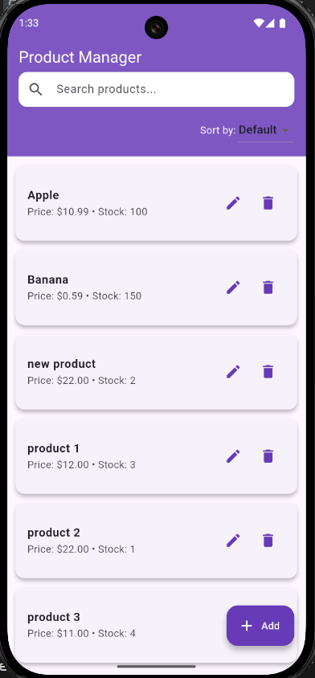
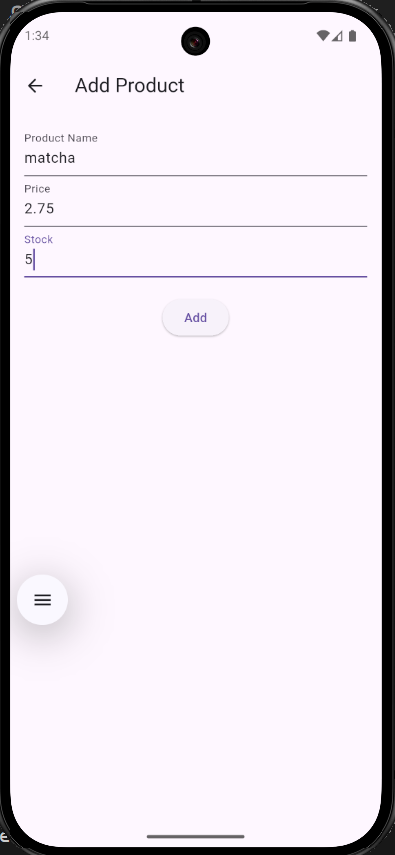
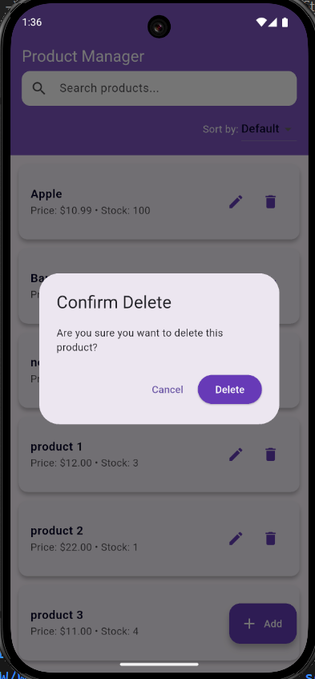
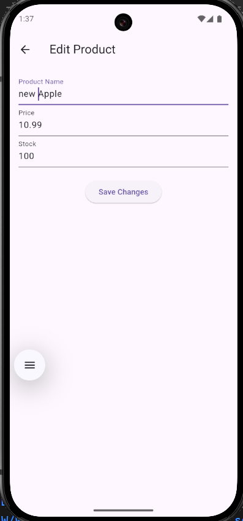
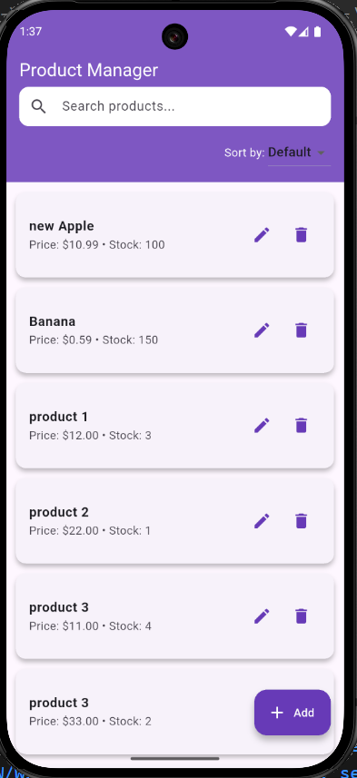
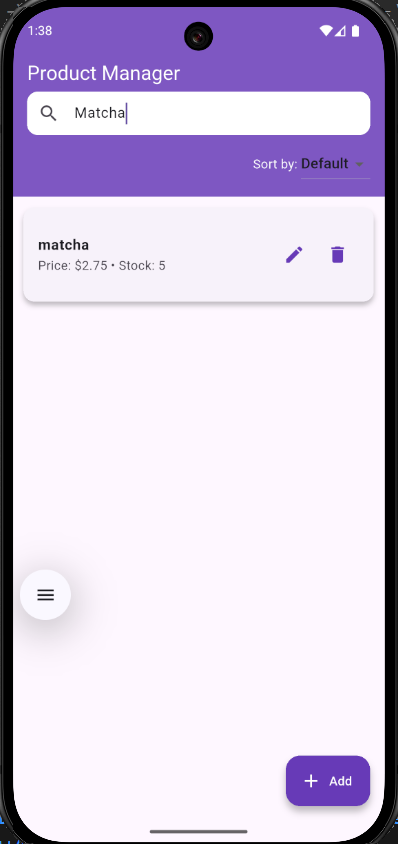
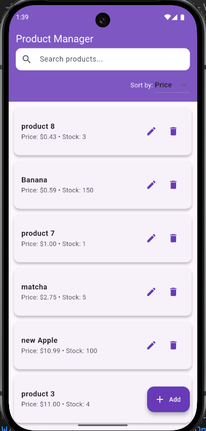

# Full Product CRUD App – Internship Coding Test

This project is a complete Full-Stack Product Management app using Flutter + Express.js + SQL Server.

## Tech Stack
- **Backend**: Node.js, Express, SQL Server (`mssql`, `cors`, `dotenv`)
- **Frontend**: Flutter, Provider
- **Database**: Microsoft SQL Server

---

## Folder Structure

- `/backend` -> Express.js REST API
- `/frontend` -> Flutter App
- `/database` -> SQL script to create table + seed data

---

## Setup Instructions

### 1. Database Setup (SQL Server)
- Install Microsoft SQL Server and SQL Server Management Studio (SSMS).
- Create database: `ProductDB`
- Run script: `database/products.sql`

### 2. Backend Setup
```bash
cd backend
cp .env.example .env

# backend/.env.example
DB_USER=username
DB_PASSWORD=password
DB_SERVER=localhost
DB_DATABASE=ProductDB
PORT=3000

# Fill in database credentials in .env
npm install
node server.js
```

### 3. Frontend Setup
cd frontend
flutter pub get
flutter run

## API base URL
http://localhost:3000

### Fetch all products
**GET** `http://localhost:3000/products`

### Fetch product by ID
**GET** `http://localhost:3000/products/1`

### Create a new product
**POST** `http://localhost:3000/products`
```json: 
{
  "productName": "Apple",
  "price": 1.99,
  "stock": 100
}
```
### Update product by ID
**PUT** `http://localhost:3000/products/1`
```json: 
{
  "productName": "new Apple",
  "price": 1.99,
  "stock": 100
}
```
### Delete product by ID
**DELETE** `http://localhost:3000/products/1`

## Screenshots

### Product List Page


### Add Product Page


### Delete Product 


### Edit Product Page




### Search Product


### Filter Product (price)
